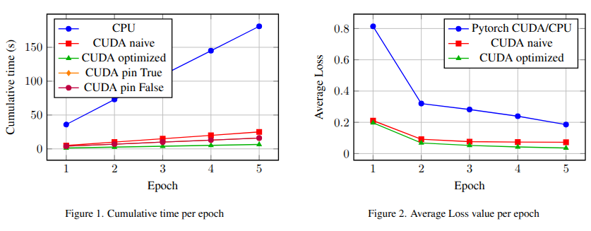

# CUDA CNN From Scratch

This project provides an optimized implementation of a Convolutional Neural Network (CNN) written entirely in CUDA. The network is developed from scratch without relying on any deep learning frameworks such as PyTorch, TensorFlow or cuDNN.

The goal of this project is to demonstrate how a full training and inference pipeline can be manually implemented on GPU, including forward propagation, backward propagation, memory management and parameter updates.
In addition to implementing a fully custom CUDA pipeline, this project aims to highlight the differences between a neural network written entirely from scratch and the equivalent implementation using the PyTorch library.

While the custom CUDA version provides full control over kernel design, memory allocation, and parallelization strategies, PyTorch abstracts these details and relies on optimized backend libraries.
In particular, the PyTorch experiments analyze how performance varies when modifying two key DataLoader parameters: `num_workers`, which controls the number of subprocesses used for data loading and `pin_memory`, which enables page-locked (pinned) memory allocation on the host side.

On the CUDA side, two scenarios are analyzed: a `naive` implementation that serves as a baseline and an `optimized` version that incorporates performance improvements to accelerate the training process (more details below or in the report).

<p align="center">
  
</p>

## Project Overview

The implemented neural network consists of:

  * Two convolutional layers with ReLU activations

  * A max pooling layer

  * A flatten operation

  * One fully connected layer

  * A softmax output layer

Both forward and backward passes are explicitly implemented using CUDA kernels. Stochastic Gradient Descent (SGD) is used for parameter updates.

The project supports classification on datasets such as MNIST and Fashion-MNIST.

## CUDA Key Features
  Performance optimizations includes several important GPU optimizations:
  
  * Kernel Fusion : convolution and ReLU are fused into a single kernel to reduce global memory writes and reads. This minimizes memory traffic and improves performance.
  * Shared Memory Tiling: the fully connected layer uses tiled matrix multiplication with shared memory to reduce redundant global memory accesses and improve arithmetic intensity.
  * Warp-Level Reductions: backward convolution kernels use warp shuffle instructions (__shfl_down_sync) to perform efficient reductions without excessive atomic operations.
  * Triple Buffering with CUDA Streams: three pinned host buffers and corresponding device buffers are used together with multiple CUDA streams. This enables: asynchronous memory transfers, overlap between data transfer and computation, reduced GPU idle time
  * Pinned (Page-Locked) Memory: pinned host memory is used to enable faster and truly asynchronous cudaMemcpyAsync operations.

All heavy computations remain entirely on the GPU.
The optimized implementation significantly reduces training time compared to CPU execution and Naive CUDA implementations without kernel fusion or memory optimizations

## How to run
Clone the repository and navigate into the folder (note that these commands may be differer based on which GPU system you are using).
```bash
git clone https://github.com/claudiocamolese/CUDA-CNN-from-scratch.git
cd CUDA-CNN-from-scratch
srun --gres=gpu:1 --cpus-per-task=4 --mem=2G  python dataset.py --data mnist
srun --gres=gpu:1 --cpus-per-task=4 --mem=2G  python dataset.py --data fashion
mkdir build
cd build
cmake ..
```

To run CUDA code, from the `build` folder:
```bash
cmake --build . --target naive_cnn
cmake --build . --target optimized_cnn
```

Then run the code with (note that these commands may be differer based on which GPU system you are using):
```bash
srun --gres=gpu:1 --cpus-per-task=4 --mem=2GB ./naive_cnn
srun --gres=gpu:1 --cpus-per-task=4 --mem=2GB ./optimized_cnn
```
Instead, to run Pytorch:
```bash
cd src/cpu
srun --gres=gpu:1 --cpus-per-task=4 --mem=2G  python main.py --device cuda (or cpu) --dataset mnist (or fashion) --numw 4 (or ["0", "1", "2", "4", "8"]) --pin True (or False)
```

## Expected Results
```bash
@nash:~/path-directory$ srun -p rtx6000 --gres=gpu:1 --cpus-per-task=4 --mem=2GB ./optimized_cnn 
Network --> (CONV(1, 16, 3), RELU) + (CONV(16, 32, 3), RELU) + MaxPool(2) + Flatten + FC + SoftMax
Epochs: 5, Learning rate: 0.01, Batch size: 64
Block Size: 256
Starting training for 5 epochs:
Epoch [1/5] [========================================] 100%
Epoch [1/5], avg loss=0.196685
Epoch [2/5] [========================================] 100%
Epoch [2/5], avg loss=0.067672
Epoch [3/5] [========================================] 100%
Epoch [3/5], avg loss=0.051894
Epoch [4/5] [========================================] 100%
Epoch [4/5], avg loss=0.042349
Epoch [5/5] [========================================] 100%
Epoch [5/5], avg loss=0.035604
Time for training 5 epochs is: 6.44 s
Test accuracy = 98.08%
Time for testing is: 0.13 s
```


## Possible Future Improvements

* cuBLAS integration for comparison

* Support for deeper architectures
